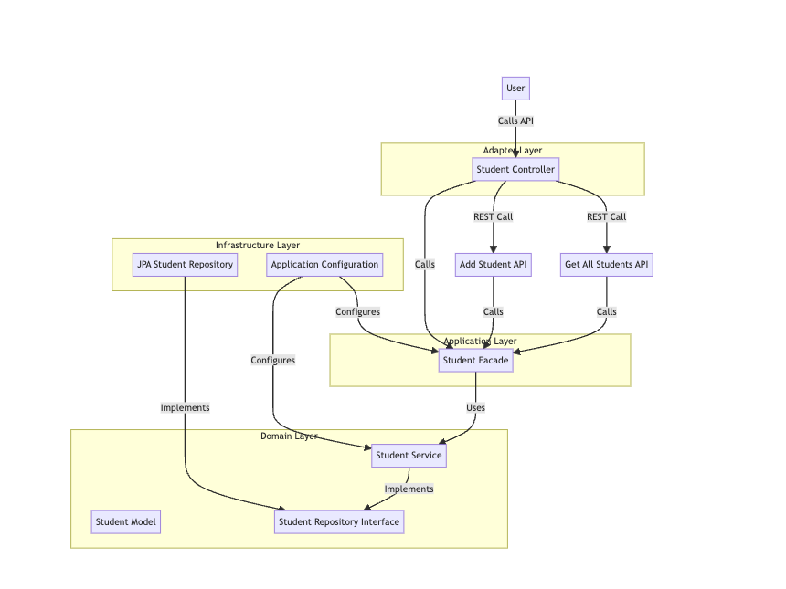

# SchoolApplication
## DDD & Hexagonal Architecture Test

## 소개
이 프로젝트는 Spring Boot를 사용하여 DDD(Domain-Driven Design)와 Hexagonal Architecture(육각형 아키텍처)를 적용하여 간단한 학생 관리 애플리케이션을 구현한 예제입니다.

## 구조

### DDD(Domain-Driven Design)
- **도메인 계층(Domain Layer)**: 비즈니스 로직과 도메인 모델을 포함합니다.
- **애플리케이션 계층(Application Layer)**: 도메인 계층을 호출하여 애플리케이션의 유스케이스를 처리합니다.
- **인프라 계층(Infrastructure Layer)**: 데이터베이스와의 통신 및 설정 파일을 포함합니다.
- **어댑터 계층(Adapter Layer)**: 외부와의 인터페이스를 담당합니다.

### Hexagonal Architecture
Hexagonal Architecture는 포트와 어댑터로 구성되어 있어, 시스템의 중심인 도메인 계층이 외부 시스템에 의존하지 않도록 설계되었습니다. 각 계층은 독립적으로 개발 및 테스트될 수 있습니다.

## 프로젝트 구조

### UserFlow



### 디렉터리 구조

src/main/java/com/example/school
├── SchoolApplication.java
├── domain
│ ├── model
│ │ └── Student.java
│ ├── repository
│ │ └── StudentRepository.java
│ └── service
│ └── StudentService.java
├── application
│ └── StudentFacade.java
├── infrastructure
│ ├── configuration
│ │ └── AppConfig.java
│ ├── repository
│ │ └── JpaStudentRepository.java
└── adapter
└── web
└── StudentController.java


## 사용된 도구 및 환경

이 프로젝트는 다음과 같은 도구와 라이브러리를 사용하여 개발되었습니다:

- **Spring Boot**: 애플리케이션 프레임워크로, 다양한 기능을 빠르게 설정할 수 있습니다.
- **Lombok**: 반복적인 코드를 줄이기 위해 사용된 자바 라이브러리입니다.
- **H2 Database**: 개발 및 테스트를 위한 인메모리 데이터베이스입니다.
- **Spring Data JPA**: JPA(Java Persistence API)를 사용하여 데이터베이스 작업을 간편하게 할 수 있도록 지원합니다.
- **Maven**: 프로젝트 관리 및 빌드를 위한 도구입니다.

### 로컬 환경 설정

1. **JDK 설치**: Java Development Kit (JDK) 11 이상이 필요합니다.
   - [JDK 다운로드](https://www.oracle.com/java/technologies/javase-downloads.html)

2. **Maven 설치**: 프로젝트 빌드 및 관리를 위해 Maven이 필요합니다.
   - [Maven 다운로드](https://maven.apache.org/download.cgi)

3. **Lombok 설치**: Lombok은 IDE와 통합되어야 합니다. 각 IDE의 설정 방법은 Lombok 공식 문서를 참고하세요.
   - [Lombok 설치 가이드](https://projectlombok.org/setup/overview)

### H2 데이터베이스 설정

`src/main/resources/application.properties` 파일에서 H2 데이터베이스를 설정했습니다.


### 실헹 방법
애플리케이션 실행:

```./mvnw spring-boot:run ```

### REST API***
***학생 추가***

URL: POST /students
Request Body:
json
```
{
    "name": "Alice Johnson",
    "age": 23
}
```


***모든 학생 조회***
URL: GET /students

